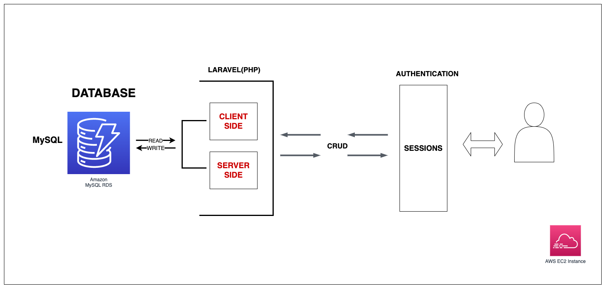
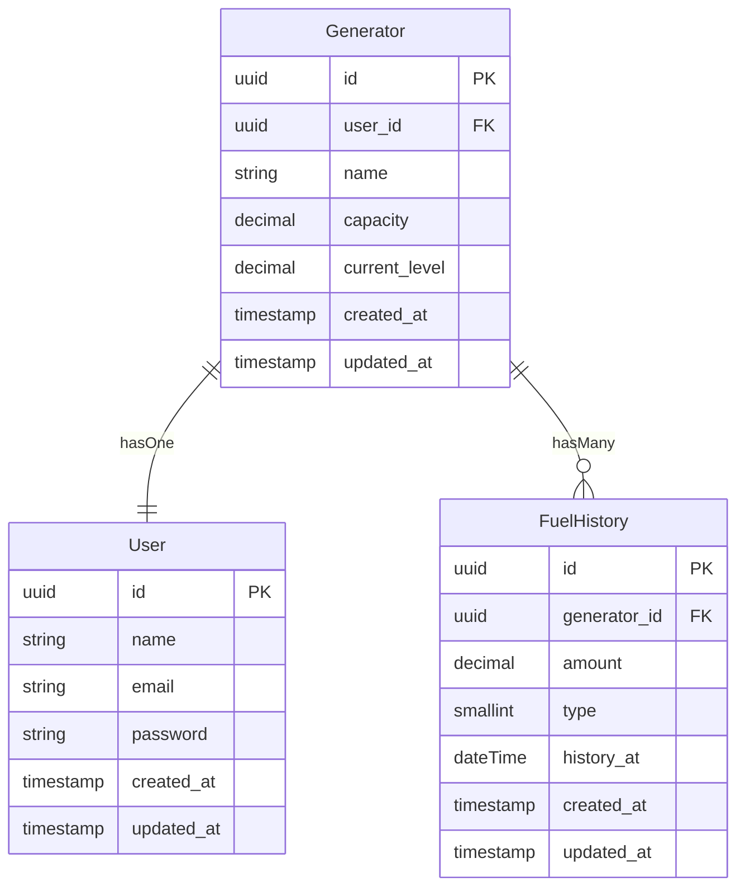
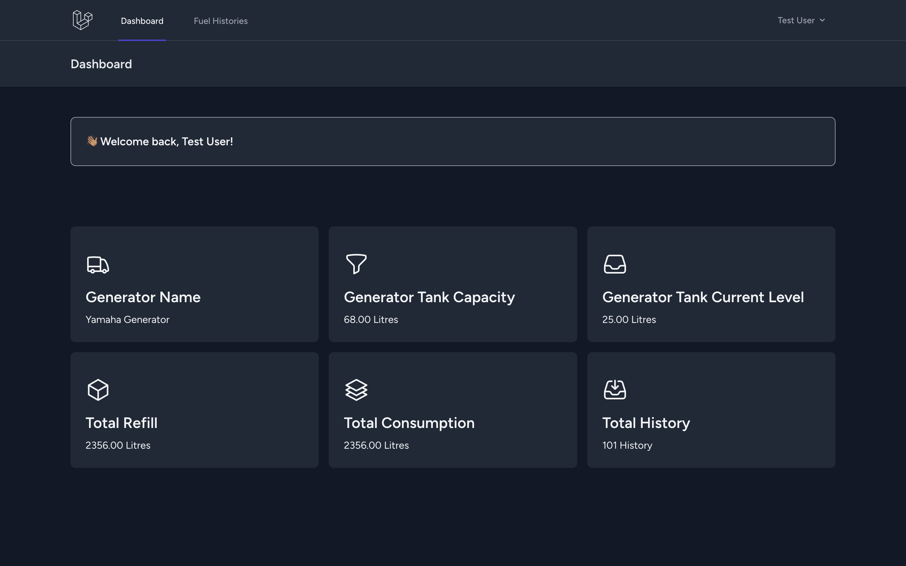
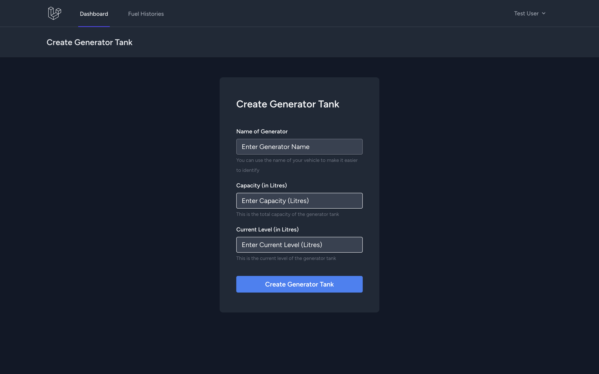
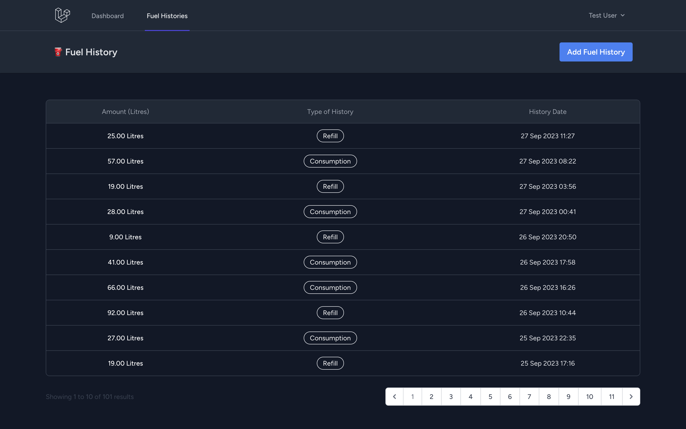
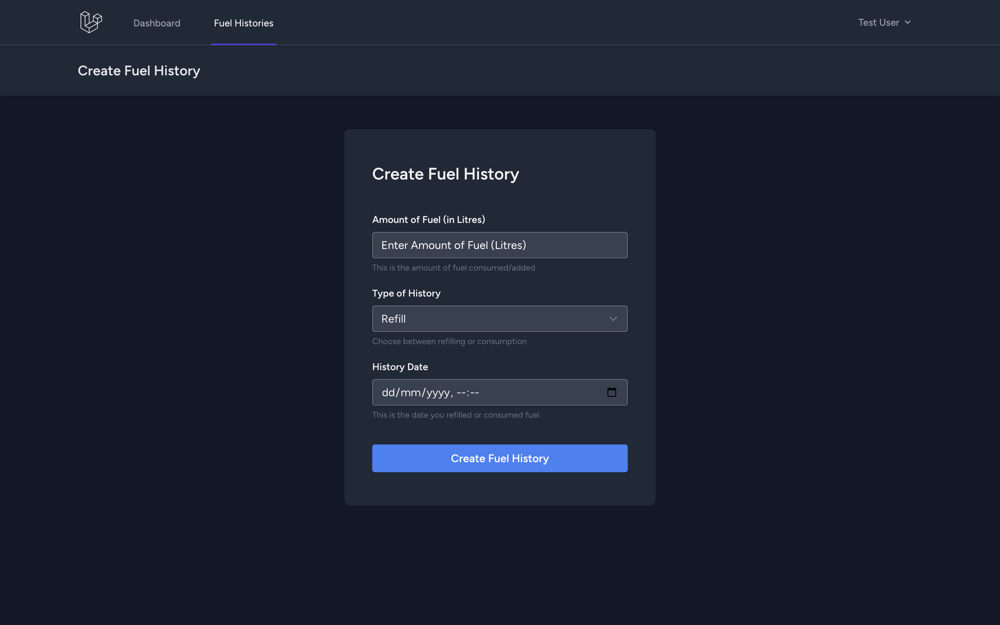

# Fuel Trakr - A Fuel Consumption Tracker
> **Note:** Problem Statement
> Due to the rising cost of fuel in Nigeria, citizens have become more conscious of their diesel usage and now want to make it a habit of tracking their diesel consumption in their generator tank. Help them design and implement a basic solution to help the citizens achieve their goal. Ensure to include support tools that citizens might need to run such an operation.

## Table of Contents
- [Fuel Trakr - A Fuel Consumption Tracker](#fuel-trakr---a-fuel-consumption-tracker)
  - [Table of Contents](#table-of-contents)
  - [Problem Analysis](#problem-analysis)
  - [User Story](#user-story)
    - [New User - Story](#new-user---story)
    - [Returning User - Story](#returning-user---story)
  - [Systems Architecture](#systems-architecture)
    - [Architecture - Why Monolith?](#architecture---why-monolith)
    - [Programming Language - Why PHP?](#programming-language---why-php)
    - [Framework - Why Laravel?](#framework---why-laravel)
    - [Database - Why MySQL?](#database---why-mysql)
    - [Server - Why AWS EC2?](#server---why-aws-ec2)
  - [Database Schema](#database-schema)
  - [Screenshots](#screenshots)
    - [Dashboard Page](#dashboard-page)
    - [Create Generator Page](#create-generator-page)
    - [Fuel History Page](#fuel-history-page)
    - [Create Fuel History Page](#create-fuel-history-page)
  - [Requirements](#requirements)
  - [Installation](#installation)
  - [License](#license)
  - [Conclusion](#conclusion)

## Problem Analysis
- User should be able to authenticate with the system
- User should be create a generator tank
- User should be able to add fuel purchase to a generator tank
- User should be able to add fuel consumption to a generator tank
- User should be able to view fuel purchase history

## User Story
> As a user in Nigeria, I want to track my diesel consumption in my generator tank so that I can manage my fuel expenses efficiently.
### New User - Story
- The user goes to the application website and creates an account by providing their name, email address, and password.
- Once the account is created, the user is logged in and taken to the dashboard page.
- On the dashboard page, the user can see their current fuel level, fuel consumption over time, and other relevant information.
- The user can also view a detailed log of their fuel consumption by going to the history page.

### Returning User - Story
- The user goes to the application website and logs in with their email and password.
- Once the user is logged in, they are taken to the dashboard page.
On the dashboard page, the user can see their current fuel level, fuel consumption over time, and other relevant information.
- The user can also view a detailed log of their fuel consumption by going to the history page.

## Systems Architecture

### Architecture - Why Monolith?
The web application is a monolith because it is a small application that does not require a microservice architecture. The application may scale in the future, but monolith architecture can handle the load due to the small size of the application.
### Programming Language - Why PHP?
PHP is well suited for the application because it is a web application that will be deployed on the web. The application only has one feature **Fuel Consumption Tracking**, and PHP can handle millions of records for tracking fuel consumption.
### Framework - Why Laravel?
Laravel is a PHP framework that is well suited for this problem because of it's inbuilt features that will be used in the application. The built-in authentication system that will be used to authenticate users. Laravel ORM can also be used to interact with the database. It also allows for future expansion of the application, like creating an API for the application to be used in a mobile application or IoT device.
### Database - Why MySQL?
MySQL is a relational database that is well suited for this problem because of the relational nature of the data.
### Server - Why AWS EC2?
It's easy to setup and maintain. If in the future the application needs to scale, it can be easily scaled by adding more EC2 instances with better performance compared to AWS Beanstalk or Lightsail.

## Database Schema


The database schema is a simple one-to-many relationship between the User and Generator table. A user can have one generators, and a generator can have many fuel history. The fuel history table stores the amount of fuel added or consumed and the type of history. The type of history can be either **refuel** or **consumption**.

## Screenshots
### Dashboard Page
A user can view their current fuel level, fuel consumption over time, and other relevant information.

### Create Generator Page
A user can create a generator by providing the name and capacity of the generator and the current fuel level.

### Fuel History Page
A user can view a detailed log of their fuel consumption by going to the history page.

### Create Fuel History Page
A user can add fuel purchase to a generator tank or add fuel consumption to a generator tank.


## Requirements
In order to run this solution, you need to have the following installed on your machine:
- PHP 8.0
- Composer
- MySQL 8.0
- NodeJS 16.19.0

## Installation
Installing the application is easy. Follow the steps below to install the application on your machine.
1. Clone the repository
```bash
git clone https://github.com/hendurhance/fuel-trakr.git
```
2. Go to the project directory
```bash
cd fuel-trakr
```
3. Copy the `.env.example` file to `.env`
```bash
cp .env.example .env
```
4. Setup MySQL database and update the `.env` file with the database credentials
``` env
DB_CONNECTION=mysql
DB_HOST=<your-database-host>
DB_PORT=<your-database-port>
DB_DATABASE=<your-database-name>
DB_USERNAME=<your-database-username>
DB_PASSWORD=<your-database-password>
```
4. Install the dependencies using `scripts/installation.sh` script
```bash
./scripts/installation.sh
```
*** Note: If you get a permission error, run the command below to give the script permission to execute. ***
```bash
chmod +x ./scripts/installation.sh
```

## License
[MIT](./LICENSE)

## Conclusion
The application is a simple solution to the problem of tracking fuel consumption in Nigeria. The application can be improved by adding more features like:
- Adding a feature to track the cost of fuel
- Notify the user when the fuel level is low
- Create an API for the application to be used in a mobile application or IoT device